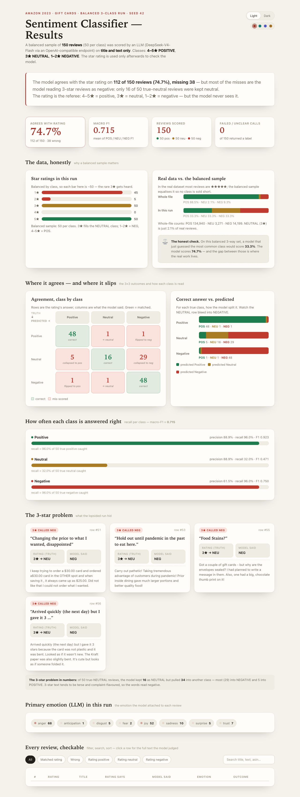

# Amazon Review Sentiment Classifier — MBAX 6418 Assignment 1

An agent-driven sentiment classifier for Amazon **Gift Cards** reviews. Each review is
classified **Positive / Neutral / Negative** (and given a primary emotion) by a large
language model called through an OpenAI-compatible endpoint, working from **only the review
title and text** — never the star rating. The star rating is used strictly afterwards as the
ground-truth check. Results are presented in a self-contained, offline HTML dashboard.

> **Data source:** [Amazon Reviews '23](https://amazon-reviews-2023.github.io) — the
> "Gift Cards" review category, collected by the **McAuley Lab, University of California San
> Diego** (larger researchers may cite Ni, Li and McAuley, *Justifying Recommendations using
> Distantly-Large-Scaled Review Data*, arXiv:2304.14651). The raw file is the public
> gzipped JSON-lines download
> `review_categories/Gift_Cards.jsonl.gz` on the McAuley Lab dataset host, containing
> **152,410** reviews with fields `rating, title, text, images, asin, parent_asin, user_id,
> timestamp, helpful_vote, verified_purchase`.

Primary emotion is computed **two independent ways** and compared: the LLM predicts it, and a
**word list (the NRC Emotion Lexicon / EmoLex)** derives it by scoring each review's words
([Mohammad & Turney 2013](https://saifmohammad.com/WebPages/NRC-Emotion-Lexicon.htm),
*Crowdsourcing a Word-Emotion Association Lexicon*, Computational Intelligence 29(3)).

---

## Method

- **Model / endpoint:** `DeepSeek-V4-Flash-0731` over an OpenAI-compatible endpoint
  (`http://dobolyi.com:9000/v1`). `temperature=0`.
- **Prompt:** encourage exactly one machine-readable line `SENTIMENT|EMOTION` per review
  (see [`prompt.md`](prompt.md)). Sentiment ∈ {POSITIVE, NEUTRAL, NEGATIVE}; emotion ∈ the 8
  EmoLex classes {anger, anticipation, disgust, fear, joy, sadness, surprise, trust}.
- **Ground truth (check only):** `rating 4–5 → POSITIVE`, `3 → NEUTRAL`, `1–2 → NEGATIVE`.
  The rating is read back **after** the model answers; it is never sent to the model.
- **Class mapping used historically:** Step 2 treated sentiment as **binary** (`≥4 → positive,
  else negative`, so 3-star folded into negative); Step 6 and later use the full three-class
  split above.
- **Balanced sampling:** because the dataset is ~88.5% positive, reading reviews in file order
  under-represents the rare classes. Instead, **50 reviews per class** (150 total) were drawn
  with a **fixed seed (`random.seed(42)`)** so the same balanced set is produced every run.
- **Word-list take:** EmoLex v0.92 (4,454 words covering the 8 emotions) scores each review's
  lowercased `title + text` tokens; per-emotion indicator counts are summed and the argmax is
  the predicted primary emotion (ties broken by canonical order). No model calls.

**Reproduce:** the one-command pipeline is `sample_balanced.py → score_balanced.py →
eval_balanced.py → build_dashboard.py`; see the [file index](#files) and
[report-checking](#every-number-checked) below.

---

## Two runs, and why the balanced one tells a truer story

### Run 1 — first 100 reviews in file order, binary (Steps 1–2)

The first 100 reviews were overwhelmingly high-rated: **93 positive, 7 negative**. Against the
binary rating rule the model agreed **98/100 = 98.0%** (Macro-F1 **0.923**), missing only two:

| Row | Rating (truth) | Model said | Title |
|----|----------------|-----------|-------|
| #18 | ★★★★★ → POSITIVE | NEGATIVE | *No note attached to sent gift card* |
| #99 | ★★★☆☆ → NEGATIVE (binary) | POSITIVE | *Easy to use* |

Look at those two for a second — they are **text-vs-rating conflicts**, not blunders. Row #18
left five stars yet the *text* is a complaint (the note was missing); the model read the words.
Row #99 says "Easy to use" but got only three stars. Both disagreements are the review's words
and its stars disagreeing.

**Why 98% is misleading here:** a model that *always* says POSITIVE would have scored **93%**
by doing nothing — the dataset is that lopsided. The apparent accuracy mostly reflects the easy
majority class, not model skill.

### Run 2 — balanced 3-class sample (Steps 6–7)

The same model, retrained prompt to a three-class task, on **150 balanced reviews
(50 per class)** from the whole file:

**Real-world class balance (whole file):** POSITIVE **88.5%** (134,940) · NEUTRAL **2.1%**
(3,271) · NEGATIVE **9.3%** (14,199).

| Metric (balanced run) | Value |
|---|---|
| Overall agreement with rating | **74.7%** (112/150, 38 wrong) |
| Macro-F1 (mean of 3 classes) | **0.715** |
| Majority-class baseline | **33.3%** |
| Failed / unparseable calls | 0 / 150 |

**Confusion matrix** (rows = rating truth, cols = model's call):

| truth \ pred | POSITIVE | NEUTRAL | NEGATIVE |
|-------------|----------|---------|----------|
| **POSITIVE** | 48 | 1 | 1 |
| **NEUTRAL** | 5 | 16 | **29** |
| **NEGATIVE** | 1 | 1 | 48 |

**Per-class:**

| Class | n | Precision | Recall | F1 |
|-------|---|-----------|--------|-----|
| POSITIVE | 50 | 88.9% | 96.0% | 0.923 |
| **NEUTRAL** | 50 | 88.9% | **32.0%** | **0.471** |
| NEGATIVE | 50 | 61.5% | 96.0% | 0.750 |

(The balanced sample's star spread was 1★:45, 2★:5, 3★:50, 4★:0, 5★:50 — under this seed the
50 positives all happened to be 5★.)

---

## Q&A — the four report questions

### 1. Why did the lopsided run look very accurate, and what did equal sampling change?

The lopsided binary run looked great (98%) because ~93% of reviews were the easy, dominant
positive class. Balancing the classes and adding NEUTRAL as its own class strips that away: the
honest number is **74.7%** overall and **0.715** macro-F1, versus a 33.3% "guess the majority"
baseline. Equal sampling also surfaced a class the unbalanced run **could not even test**:
NEUTRAL (3★), which is only 2.1% of the real data and which the binary rule had forcibly folded
into NEGATIVE without ever asking the model to distinguish it.

### 2. Which classes get confused with which, and in what direction?

From the confusion matrix above, the direction is almost entirely **NEUTRAL → NEGATIVE**.
Of the 50 true-3★ reviews, **29 (58%) were called NEGATIVE** and 5 were called POSITIVE; only
16 were kept NEUTRAL. The reverse directions are nearly absent (POS→NEU 1, POS→NEG 1, NEG→NEU 1,
NEG→POS 1). 3-star text tends to be terse and complaint-flavoured ("The envelope is ripped",
"Changing the price… disappointed"), so the model reads the *words* as negative rather than the
lukewarm 3-star calibration as neutral. The knock-on effect is visible in precision: **NEGATIVE
precision (61.5%) is pulled down** precisely because the model's overlaps into NEGATIVE are
mostly 3★ reviews, not real 1–2★ complaints.

### 3. How do the LLM's emotions and the word list's emotions differ, and why?

Comparisons are on the same 100 reviews from Run 1 (both takes ran there).

| Emotion | LLM | NRC word list |
|---------|-----|---------------|
| joy | **87** | 21 |
| anticipation | 2 | **59** |
| anger | 5 | 2 |
| trust | 4 | 1 |
| sadness | 1 | 1 |
| disgust | 1 | 1 |
| fear | 0 | 0 |
| surprise | 0 | 0 |
| (no emotion found) | 0 | 15 |

Exact agreement: **21/100 (21%)** — or 24.7% on the 85 reviews where both produced a valid
emotion. The single largest divergence was **LLM=joy vs NRC=anticipation (51 reviews)**.

**Why they differ.** The NRC take is literal bag-of-words: it cannot handle **negation,
sarcasm, emphasis or context**, and many everyday evaluative words it lacks entirely. For
example, the words `gift` and `good` map to multiple emotions including anticipation and joy,
so NRC piles up anticipation on any "good gift" review — and ties resolve to anticipation. The
LLM reads the whole review and reports the *felt* emotion, giving joy. Concrete cases:

- **Row #5, "Not $10 Gift Cards" (1★):** NRC sees literals like `gift` and `good` and returns
  **joy**; the LLM reads the complaint ("it had $6.52 on the card not $10.00") and returns
  **anger**. The word list is negation- and complaint-blind; the LLM is not.
- **15 reviews** contained **no emotion word** NRC recognises at all (e.g. generic-looking
  positives like "Easy to use": the words `easy`/`great`/`nice`/`worth` are absent from EmoLex),
  so the word list returns "none" where the LLM still picks an emotion.

In short: the LLM captures meaning; the word list captures surface word associations — the two
agree largely only on unambiguously worded reviews.

### 4. Bugs and issues hit along the way, and workarounds

1. **`gunzip … | head` timeouts + shell-pipe fragility** — streaming the gzip via shell pipes
   intermittently failed read timeouts. **Fix:** moved extraction into a file-based Python
   function using `gzip.open`, avoiding fragile pipelines.
2. **Endpoint config parsing** — the API key lives under `custom_providers`, not the top-level
   `model:` block, so the first naive loader had no key (the endpoint happened to accept a blank
   one). **Fix:** a `load_endpoint` helper that falls back to the matching custom provider.
3. **API batch > 180 s foreground cap** — 100–150 sequential model calls exceeded the shell
   timeout. **Fix:** ran scoring as a background process with completion notification.
4. **Confusion-matrix label layout** — narrow rail made "truth POSITIVE" wrap/rotate. **Fix:**
   widened the rail and used plain "Positive"/"Neutral"/"Negative" labels.
5. **Collapsed stacked-bar segments (the one the brief warns about):** in the dashboard's
   "Correct answer vs predicted" chart, fine-grained segments (counts of **1**) rendered at
   **zero width and were invisible**. **Fix:** the bars now show *proportions only* and each
   exact count is printed on a separate coloured line beneath its bar — so small counts can
   never be erased by layout. Verified again in a headless browser render.
6. **Tight matrix-cell notes** — longer notes like "collapsed to negative" brushed cell edges;
   **fix:** increased cell min-height.
7. **`idx` as string in CSV** — a `idx + 1` bug in the evaluator; **fix:** cast to `int`.
8. **NRC download link 404** — the expected direct `.txt` URL was gone; the real zip was found
   from the lexicon homepage (`NRC-Emotion-Lexicon.zip`, then extracted with the README/citation
   intact).
9. **Dashboard review table rendered empty / the filter tabs did nothing** — the row-building
   code passed the row number to an HTML-escape helper as a *number*, so `(s || "").replace`
   threw a `TypeError` on the very first row; `render()` aborted, leaving an empty table and
   making the filter/search/sort controls appear to "do nothing" on every click. **Fix:** made
   the escape helper coerce any input to a string (`String(s ?? "")`). The page also now
   hardens the theme store — Chrome blocks `localStorage` on `file://` URLs, so it falls back
   to an in-memory store instead of throwing. Verified by re-running the page's own script in
   Node against the saved data (clicking "Rating negative" now yields "Showing 50 of 150
   reviews (filtered)") and by a headless-browser render showing all 150 rows.

---

## Files

| File | Role |
|------|------|
| `prompt.md` | The reusable prompt + parsing contract |
| `sample_balanced.py` | Fixed-seed balanced sample (50/class from the whole file) |
| `score_balanced.py` | 3-class LLM scoring (sentiment + emotion) → balanced run raw output |
| `predictions_balanced.csv` | **The balanced run's raw output** (one row per review) |
| `eval_balanced.py` / `eval_balanced_report.txt` / `confusion_balanced.csv` | 3×3 evaluation + report |
| `score_batch.py` | Step-2 binary scoring over the first 100 (Run 1) |
| `predictions.csv` | Binary run output |
| `score_llm_emotions.py` / `predictions_with_emotions.csv` | LLM emotion take |
| `nrc_emotions.py` / `emotions_nrc.csv` | Word-list (EmoLex) emotion take |
| `compare_emotions.py` / `emotions_comparison.csv` / `emotions_report.txt` | LLM vs NRC comparison |
| `build_dashboard.py` + `_dashboard_template.html` | Dashboard generator (self-contained) |
| `dashboard.html` | **Final dashboard** — open it in any browser, fully offline |
| `screenshots/dashboard.png` | Captured image of the dashboard |
| `data/` | Sample, meta, and the extracted EmoLex lexicon |
| `check_dashboard.py` | Verifies the page's numbers against the saved CSVs |

Run `sample_balanced.py → score_balanced.py → eval_balanced.py → build_dashboard.py` to
regenerate the balanced run and dashboard. `python check_dashboard.py` proves the HTML's numbers
recompute to the same figures as the saved CSVs.

## Every number checked

`check_dashboard.py` re-parses the *rendered* `dashboard.html` and compares it to the saved
output: the embedded 150 rows (truth/pred each match `predictions_balanced.csv`), the 50/50/50
balance, the 112 correct, the confusion rows vs `confusion_balanced.csv`, and the star/class
distributions. All checks pass — so the figures quoted above are the figures the dashboard and
the saved output agree on.
